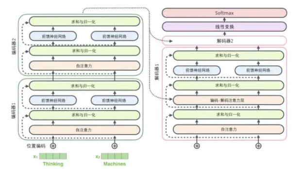

# 文本挖掘和NLP相关内容
## 1.  主题模型（待补充...)
1. 词在文档中不考虑顺序（BOW)
2. 文档生成
- unigram-model
    - 单词独立生成
    
    - 最大似然估计 
      
        >$p(\theta_v) = \frac{n_v}{n}$, 数据集D中wordv出现的频次/数据集中单词的总个数n
        
    - 最大后验估计: 参数的似然分布为多项分布，先验假设为Dilichlet分布，则参数的后验分布也为Dilichlet分布
    
- LSI（潜在语义分析）

    - 文档-词项矩阵
    - SVD分解
    - 得到词项、文档的概念表示，可计算相似度

- pLSA(概率隐语义分析，最大似然)
    - 规律：相同主题的词经常出现在同一文档中，不同主题的词很少出现在同一文档中
    - 模型假设： 整个语料共享K个主题，每个主题都有生成单词的概率分布，每个docement是K个主题的混合（混合比例固定)
        $$
        p(word_v|D_i) = \sum_{t=1}^{K}p(topic_t|D_i)p(word_v|topic_t) \\= \sum_{t=1}^{K}\varphi_{i,t}\theta_{t,v}
        $$
    - 求解方法：
        - 矩阵分解
          
            > $p(word_v|D_i)$为观测变量，矩阵求解$\varphi_{i,t},\theta_{t,v}$
        - EM
            1. 令m=0,为$\varphi_{i,t}^{<m>}$,${\theta_{t,v}^{<m>}}$赋初值;
            2. 计算后验概率 $p(topic_t|D_i,word_v) =\frac{\varphi_{i,t}^{<m>}.\theta_{t,v}^{<m>}}{{\sum_{t=1}{K}\varphi_{i,t}^{<m>}.\theta_{t,v}^{<m>}}}$
            3. 计算Q函数.... 
            4. 最大化
                (1).  $\varphi_{i,t}^{<m+1>} = \frac{\sum_{v=1}^{V}c(i,v)p(topic_t|D_i,word_v)}{n_i}$
                    - 文档$D_i$中每个位置背后，数据主题$topic_t$的频数（以概率计算)除以总位置的的占比
                (2). $\theta_{t,v}^{<m+1>} = \frac{\sum_{i=1}^{N}c(i,v)p(topic_t|D_i,word_v)}{\sum_{v=1}^{V}\sum_{i=1}^{N}c(i,v)p(topic_t|D_i,word_v)}$
                        - 单词$word_v$在数据集$D$中属于$topic_t$的频率(按概率计算)与数据集中属于主题$topic_t$的总频率(按概率计算)
    
- LDA（隐Delichilet分析，最大后验）
    - pLSA中参数$\mathbf{\varphi}$,$\mathbf{\theta}$是常数,  而LDA 假设每篇文档的$\mathbb{\varphi_m}$,$\mathbb{\theta_m}$是随机变量, 具有超参分别为$\alpha,\beta$ (所有文档公用）的dirichlet先验分布，$D_i$的主题分布和主题单词分布假设服从dirichlet先验(为多项式分布的共轭分布)
    - 一篇文档的主题分布不再固定，主题的单词分布也不再固定
    - 参数空间不会随着文档数的增加而增加，但是常需要计算统计量(期望)作为文档-主题，主题-单词分布的估计；pLSA中都是要学习的参数；
    - Dir($\alpha$), Dir($\beta$)作为$\mathbb{\varphi_m}，\mathbb{\theta_m}$先验分布，根据所有观测到的文档和单词，计算$\theta_m,\varphi_m$ 的后验分布,也是Dir分布，将Dir分布的期望作为最后的结果
    - 求解方法：
        - 基本假设，同一篇文档中的相同单词来自同一主题
        - 变分推断
        - 吉布斯采样
    - 推理时： 保持训练文档中主题-单词分布不变， 在新文档上运行gibbs采样，得到文档-主题的dir分布，其期望作为输出
## 2. 词向量
- 概览

1. **基于全局矩阵分解**
   
    - VSM(向量空间模型)
        - document-word 矩阵$\mathbf{W_{ij}}$，矩阵元素可以是单词是否出现（0，1）或者单词的统计特征tf-idf
        - 文档相似度： $sim(Di,Dj) = cos(\mathbb{w_i},\mathbb{w_j})$
    - 共现矩阵
    - LSA(latent semantic anaysis)/LSI
        - document-word 矩阵进行SVD分解 $\mathbb{D}=\mathbf{P}\mathbf{\Sigma}\mathbf{Q^T}$
        - $\mathbf{P}$为文档-主题矩阵
        - $\mathbf{\Sigma}$为主题强度
    - $\mathbf{Q^T}$为主题单词矩阵
    
2. 基于上下文Word2vec:
    - CBOW
        - 多个单词到一个（起到smoothing作用，善于预测出现次数多的单词)
    - skip-gram
        - 适用small data
        - 对出现次数比较少词预测效果好（中心词->上下文有很多的样本)

3. 基于全局矩阵(共现矩阵)+上下文
    - glove
    - 所有语料中单词k出现在单词i上下文的占比/单词k出现在单词j上下文的占比 有一定的规律,词向量应该体现相同的规律;
    - $F(\mathbb{\vec{w}_i},\mathbb{\vec{w}_j},\mathbb{\vec{w}_k}) = \frac{P_{i,k}}{P_{j,k}}$
    -  $F(\mathbb{\vec{w}_i},\mathbb{\vec{w}_j},\mathbb{\vec{w}_k})$根据数学理论可设置为$e^{(\vec{w}_i-\vec{w}_j)*\vec{w}_k}$
    - $P_{i,k} = \frac{X_{i,k}}{X_{i}}$
    - 对数变换并加偏置项保持对称性
    - $log(X_{i,j}) = \vec{w}_i^T*\vec{w}_j + b_i + b_j $
    - **损失函数** $J=\sum_{i,j}^{N} f(X_{i,j})(\vec{w}_i^T*\vec{w}_j + b_i + b_j -log(X_{i,j}))^2$
      
        >$f(X_{i,j})$为权重

- fastText
    - 与CBOW类似，但是是直接对文本进行分类
    - 输入为整篇文档的单词，输出是文档的类别

**以上所有单词的embedding都是静态的，不能解决一词多意的问题**

## 3. 词向量的扩展
1. Item2Vec
    - 一个session内的物品看成上下文，类似word2vec学习item的embedding
2. sentence2vec
    - sentence中每个单词embedding的平均
    - sentence中每个单词的加权平均
    - 基于sentence之间的上下文关系(skip-throuph)
        - 利用句子(${\vec{s_{t-1}},\vec{s_t},\vec{s_{t+1}}}$), 用LSTM编码$\vec{s_t}$,最后隐藏的输出分别级联到句子$\vec{s_{t-1}},\vec{s_{t+1}}$的开头去预测两个句子中的单词
    - 基于sentence的上下文关系(quick-through)
        - 每个句子分别编码成vector, 利用句子之间是否是上下文softmax损失学习vector
    - 基于句子是否相似的标签（inferSent）
        - 每个句子分别经过LSTM，输出embedding进过级联输出到二分类器
    - 多任务联合
        - 具体任务训练的vector编码了具体任务的信息，多任务训练的sentence embedding具有更好的泛化能力
    
3. doc2vec
    - 句子的平均
    - document顺序作为一个输入嵌入到document中句子的训练任务中

## 4. 预训练语言模型
1. transform（attention is all your need):
    - 基于attention机制实现的特征提取，可代替CNN，RNN来提取序列特征，容易并行化

    - encoder-decoder
         
         
    - encoder的每层为两个子层：
        - multi-head self-attention
            - 能捕获双向关系$Attention(\mathbf{Q},\mathbf{K},\mathbf{V}) = softmax(\frac{\mathbf{Q}\mathbf{K}^T}{\sqrt{d_k}})\mathbf{V}$
            - self-attention的输入输出维度一致（隐层维度）
            - multi-head从不从表示空间提取序列特征($d_h=d_{model}//h$)
            - 同一个head在不同层参数不同，有多少个head i的参数为$\mathbf{W}_q^i,\mathbf{W}_k^i,\mathbf{W}_v^i$  
            - multi-head的输出最后级联转换到输入一样的维度
            <!--  -->
            - 

    - FFN
        - $\vec{O}_m=\mathbf{W_2}.Relu(\mathbf{W_1}\vec{v}_m+\vec{b_1}) + \vec{b_2}$
        
        - 输入输出维度一致
            - 同一层不同位置使用的参数相同
            - 不同层使用的参数不同
        
        - 每个子层都使用残差连接(相加) + layerNorm(CHW)
        
        - 每个子层的输入序列长度和输出序列长度一致,
        
            
        
    - decoder每层有三个子层

        - mask-self attention 屏蔽序列后的单词，位置i的attention只依赖之前的结果
        - 通过将softmax对应于mask位置的输入置为$-\infty$实现
        - self-attention层 需要考虑causal mask + pad_mask
        - cross-attention层 需要靠 pad_mask

    - decoder encoder attention 捕获输出输出直接的关系，query 来自前一个 decoder 层的输出,key和value来自encoder顶层编码器输出转换的K,V向量

        - 

    - FFN (和encoder类似)

    - input
        - token embedding
        - position embedding： 因attention不能体现序列的位置关系，输入中加入position embedding
            - 正弦编码
                - $p_{i,2j} = sin(\frac{i}{10000^{2j/d_{model}}}),p_{i,2j+1}=cos(\frac{i}{10000^{2j/d_{model}}})$，`i`为序列位置，`j`为向量的维度位置
                - 位置直接的相关性强度体现出与位置远近有关
                - 不同序列之间的embedding可以相互表示
            - 网络学习
            - 两种方式性能差别不大，但固定方式的 position embedding 可以在测试阶段处理那些超过训练序列长度的测试序列

    - learning_rate

        $lrate = d_{\text{model}}^{-0.5} \cdot
          \min({step\_num}^{-0.5},
            {step\_num} \cdot {warmup\_steps}^{-1.5})$ 
        
        http://nlp.seas.harvard.edu/2018/04/03/attention.html

2. transformer-XL : attentive language model beyond a fix-length context
    - transformer 的问题：
        - transformer按固定长度切分语料只能提取固定长度的上下文
        - 语句分割导致边界地方上下文破碎
    - transformer-XL 如何解决：
        - 片段级别的递归机制： 缓存前一句段隐藏状态，作为模型处理当前句段时的拓展上下文使用（通过级联前一个语句段的浅隐藏层来捕获更长的上下文依赖），$\tau$为语句段，$n$为第几层
            >1. $\mathbb{\hat{h}}_\tau^{n-1}= stop\_gradient(\mathbb{h}_{\tau-1}^{n-1})||\mathbb{h}_\tau^{n-1}$  
            >2. $\mathbb{q}_\tau^n, \quad \mathbb{k}_\tau^n, \quad \mathbb{v}_\tau^n = \mathbb{h}_\tau^{n-1}\mathbf{W_q},\quad \mathbb{\hat{h}}_\tau^{n-1}\mathbf{W_k},\quad \mathbb{\hat{h}}_\tau^{n-1}\mathbf{W_v}$  
            >3. $\mathbb{h}_\tau^n = transformer\_layer(\mathbb{q}_\tau^n, \quad \mathbb{k}_\tau^n, \quad \mathbb{v}_\tau^n)$
            
            - 最长的依赖长度$O(N \times L)$,N为层数，L为语句长度
- transformer-XL复用了上下文信息导致位置编码出现重叠，单词相对位置编码保证位置信息的正确性
        
    - 如何进一步改进：
      
        - e.g., 缓存更长的上下文信息
3. ELMO
    - embedding from langauge model
    - feature-based
    - 正反向LSTM的组合（并不是真正意义上的组合）
    - 每个token能得到$2L+1$个embedding，输入下游任务进行加权组合
    - 基于上下文的embedding，每个token的embedding在不同的上下文embedding不同

4. GPT-v1 
    - 《Improving Language Understanding by Generative Pre-Training》
    - GPT 的目标是学得一个能够执行多种任务的、更通用的机器学习系统，同时不需要为每个任务提供标注数据集(zero-shot learning )，或者只需要提供很少的标注数据集(one-shot learning )
    - 步骤：
        - 首先在大量的未标记语料上进行生成式预训练(语言模型生成语句)
            - 通过transformer-decoder 来建模（只有前向依赖）
            - 最大化句子生成概率$\mathbf{L_1(s)} = \sum_{t=1}^{\tau}logP(w_t|w_{t-k},\cdots, w_{t-1};\Theta)$
        - 然后通过标记语料对具体任务进行针对性的微调
            - 针对具体任务改变网络的输出层，用监督学习微调网络参数来匹配具体任务,语句标签集合$(\vec{s},y)$
                - $\mathbf{L}_2(s)= p(y_i|\vec{s_i}) = softmax(\mathbf{W}_o.\vec{h_l}^{i})$
                - $\vec{h_l}^{i}$与预训练模型最后一层输出，监督学习只需要学习参数$\mathbf{W}_o$
            - 微调过程中引入语言模型可以增加泛化性能
                -  $\mathbf{L}_3(s) = \mathbf{L_1(s)}+ \lambda.\mathbf{L}_2(s)$

    - 任务流程图
        - 都在序列开始添加 start 标记 ，在序列结束添加 extract 标记
        - 
    
    - GPT-v2
        - 网络更深，参数更多
        - 网络结构微调，最终的attention结束后添加额外的layerNorm层

5. BERT
    - Bidirectional Encoder Representations from Transformers
    - 将预训练模型用于下游任务有两种策略
        - 基于微调的策略： 该策略在预训练期间通过单向语言模型来学习通用语言representation，而单向语言模型严重限制了预训练模型的表达能力
        - 基于特征的策略： 如 ELMo ，将预训练模型的representation 作为下游任务模型的额外特征。该策略虽然是双向语言模型，但是该模型是浅层的
        - BERT 是一个同时利用了左右双向上下文的、深度的预训练模型(Masked Language Model)
    - BERT 预训练模型包含两个预训练任务：
        - 预测被屏蔽的单词(masked language model)15%, denoise auto-encoder, maximize mask位置的最大似然
            >1. 原始的序列为$(w_1,w_2,\cdots,w_n)$
            >2. 添加噪声的序列为$\hat{\mathbb{w}}=(w_1,w_2,\cdots,w_{i-1},[mask],w_{i+1},\cdots,[mask],\cdots,w_n)$
            >3. 记被mask的token为$\overline{\mathbb{w}}=(w_i,\cdots,)$, 则模型最大化概率
            >4. $p(\overline{\mathbb{w}}|\hat{\mathbb{w}};\mathbf{\Theta})= \prod_{i=1}^{n}\mathbb{I}_{i\in mask}.p(w_i|\hat{\mathbb{w}};\mathbf{\Theta})$
        - 预测下一个句子(NSP): 用于理解两个句子的关系，语言模型不能直接捕获
    - 输入
        - work embedding = token embedding + position embedding + segement embedding(属于哪一句)
        - 每个序列的第一个 token 是一个特殊的[CLS]。网络最后一层对应于该位置的一个隐向量作为整个序列的 representation 来用于分类任务
        - 句子之间加入特殊的[sep]
    
    - 任务：
        - 句子级别分类：  [CLS] 位置的最后一层隐向量 (一个 H 维的向量) 作为整个句子的 representation， softmax
        - 区间预测： 开始和结束位置，训练目标为最大化开始 + 结束的最大似然（只考虑的正样本位置）
        - NER: 单词级别分类任务，每个输出位置softmax,这里隐含假设每个 token 的 NER label 与周围其它单词无关
    - tokenization: wordPiece(递归组合相邻频繁项)
    - 后续模型的改进
        1. whole word mask(bert_wwm)： 在该版本中一个单词要么没有被 mask、要么该单词所有的 workpiece token 都被 mask 
           
            > wordpiece可能导致的问题是可能只mask掉一个单词的piece，导致预测的只是单词的一部分，实际是一个错误的预测目标
        2. 动态mask机制(RoBERTa)，不在预处理阶段静态mask而后续一直采用该mask的训练，每次想模型输入时执行动态mask。
        3. 使用更长的序列训练(RoBERTa)
        4. 知识蒸馏(tinyBert)
    - 实际使用
        - 筛选训练数据， 剔除过长和过段的数据
        - 尝试bert+conv, bert+conv+avg_max_pooling,bert_last_layer_concat
        - 实际场景数据进行进一步预训练

            - unbias Adam
            - re-initialize top-Layers
            - longer iteration
            - mixout: at each training iteratio,each model parameter is replaced with its pre-trained value with probability $p$
            - weight-decay
            - Layer-wise-learnign rate decay: higher learning rate for top layers and lower for bottom layers
            - transferring via in intermediate task
            
            
    
6. AIBERT
    - A light BERT
    - 优化点
        - 矩阵拆分减少参数量
        - 交叉层参数共享
        - NSP->SOP(sentence order prediction)
        - no dropout 

7. ERNIE
    - Enhanced Representation through Knowledge Integration
    - 改变 BERT 的 mask 策略，通过引入 entity-level mask 和 phrase-level mask 来引入先验知识
        - 已直接嵌入先验知识不同，ERNIE 将短语级 phrase-level 和实体级 entity-level 知识通过多阶段学习集成到语言表示中，隐式的学习实体间的关系、实体的属性等知识
        - 第一阶段 Basic-level masking：使用基本的掩码策略，做法与 BERT 完全相同
        - 第二阶段 Phrase-level masking：使用基本语言单元作为训练输入，但是使用 phrase-level 的掩码策略，这个阶段模型屏蔽和预测同一个短语的所有基本语言单元
        - 第三阶段 Entity-level masking：使用基本语言单元作为训练输入，但是使用 entity-level 的掩码策略，这个阶段模型屏蔽和预测同一个命名实体的所有基本语言单元
    - Dialogue Language Model:DLM， 输入级联多条问答语句
    - ERNIE 2.0
        - 其预训练阶段的预训练任务可以持续的、增量的构建

 8. XLNet
     - auto aggressive model(e.g, GPT)： 生成式模型用于数据序列生成,它无法对双向上下文进行建模
     - auto encoder decoder model(e.g, BERT)： 判别式模型，自编码语言模型是双向的可以使用双向上下文
        - 在预训练期间引入噪声 [MASK]，而在下游任务中该噪声并不存在，这使得预训练和微调之间产生差距
        - 自编码语言模型假设序列中各位置处的 [MASK] 彼此独立，即：预测目标独立性假设
    - XLNet 是一种广义自回归语言模型，它结合了自回归语言模型和自编码语言模型的优点，同时避免了它们的局限性
    - 特点
        - permutation language model(PLM):  
            - 输入序列全排列的采样模拟上下文出现
              
                > $\mathbf{L} = E_{\vec{z}\lt \mathbb{Z}_T}\left[ \sum_{t=1}^{T} log p_{\Theta}(w_{z_t}|\mathbb{w}_{\vec{z}} \lt t)\right]$
            - 输入的顺序并没有变，通过改变attention的mask来实现
        - two-stream self attention
            - 对不同的扰动序列$(v2,v5,v1,..),(v2,v5,v3,...)$计算出是v1的概率分布和v3的概率分布相同与位置无关，实际不应如此
            - 对预测目标的上下文引入位置信息
                - 只能包含位置信息，不能包含内容
            - 当同一个位置作为其他单词的上下文时，该位置需要包含内容信息
            - 双流注意力机制由此诞生
                - content stream： 编码了上下文和$w_t$本身，普通transformer隐状态，通过word_embedding初始化
                - query stream：编码了上下文和$w_t$的位置，通过可学习参数$\vec{w}_t$初始化,预测位置$w_t$是从query stream取$w_t$的查询向量，其余位置查询向量从context stream取；
                - 两路self-attention共享参数
        - 引入transformer-XL
          
            - 相对位置编码和segment-level递归？？？
        - 微调阶段
          
            - 仅仅使用 content stream self-attention，并采用 Transformer-XL 的推断机制
    - partial-prediction
    
         - PLM由于位置排列的各种组合导致收敛速度很慢，只预测序列的最后几个token加快速度
     - 多输入：
       
         - 对两个句子A,B输入拼接为[A,SEP,B,SEP,CLS]
    
9. MT-DNN
    - 缓解监督学习数据太少的两种策略
        1. 预训练 (非监督方式，如ELMO, BERT等)
        2. 多任务（综合多个任务的监督数据，学习更加通用的representation)
    - MT-DNN(multi-task DNN)
        - 底层采用BERT结构，底层网络共享
        - 顶层结果根据任务的不同而不同

10. 模型压缩
    - sparse prior(bayesian compression): 各种先验
    - sparse matrix factrorization (ALBERT)
    - knowledge distillation(tinyBERT)
    
11. transformer 的变种( https://arxiv.org/pdf/2009.06732 )
    - 集中在low rank kernel/ fixed random pattern/ learnable pattern/ memory/ recurrence
    

