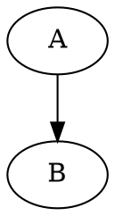

# 模型的可解释性

- [模型的可解释性](#模型的可解释性)   
- [1. 背景](#1-背景)  
- [2. 可解释性的标准](#2-可解释性的标准) 
- [3. 可解释性方法](#3-可解释性方法)    
- [4. 核保解释](#4-核保解释)

## 1. 背景
&emsp;&emsp;现如今随着移动互联网的普及，消费者在工作和生活中所产生各种类型的数据逐步在各大平台公司沉淀和累积，伴随着计算能力的提升，这些数据借助于机器学习技术发挥着越来越重要的价值，反过来也促进了机器学习技术在不断向前发展。 在金融信贷、风控等与业务紧密联系的场景中，机器学习也已经大展身手，但该领域由于其特殊性，一方面追求前沿技术的落地应用，同时也希望模型的决策具有很好的可解释性以保障决策的可信赖度。

&emsp;&emsp;对任何一个模型来说都应包含模型理解和模型解释，其重要性可体现在以下几个方面： 
- **模型改进**： 理解指标特征、分类、预测，进而理解为什么一个机器学习模型会做出这样的决定、什么特征在决定中起最重要作用，能让我们判断模型是否符合常理，直觉地判断我们的模型是否抓住了有意义的特征，模型是或否能泛化到其他样本的预测上；
- **模型可信度**： 理解机器学习模型有助于提高模型的可信度，比如在信贷和医疗领域直接让一个黑箱模型来决定人们的生活是不现实的，如果一个模型没有做出合理的决定，在应用这个模型并造成不良影响之前，我们就可以发现这一点；
- **识别和防止偏差**：有偏差的模型经常由有偏见的事实导致，如果数据包含微妙的偏差，模型就会学习下来并认为拟合很好，比如用于招聘的机器学习模型在特定的岗位上存在性别偏差，理解训练和发布的模型如何做出决策，可以事先预防偏差的增大以及消除他们。

## 2. 可解释性的标准
- **内在可解释性**：内在可解释性就是机器学习模型本质上是可解释的， 如线性模型，参数模型和基于树的模型 。事后可解释性意味着选择和训练黑箱模型 ( 集合方法或神经网络 ) 并在训练后应用可解释性方法 (特征重要性，部分依赖性图 )。

- **本地还是全局**： 全局可解释性针对模型对整体样本的行为，本地可解释性则针对模型对当个样本的预测行为

## 3. 可解释性方法

1. 基于特征分析

    内在可解释性模型相对简单，以下主要针对事后科解释性模型：
- **`permutation importance`**：一种衡量特征重要性的方法，在model训练完后，改变待分析特征的数值排列顺序并保持其余特征数值不动，用model预测扰动后数据集并重新计算metric，metric数值的改变量衡量该特征的重要程度，依次对不同的特征进行如上操作可的到所有特征的重要度。`permutation importance`蕴含的思想是一个重要的特征在随机扰乱其数值后会很大程度降低评估的效果。

- **`PDP`**: 部分依赖图显示特征对机器学习模型的预测结果的边际效应，可以展示一个特征取值变化如何影响预测，如目标与特征之间的关系是线性的、单调的还是更复杂的。基本过程是对待分析特征A，求解$E_{o}[P(Y,O|A)]$，$O$代表其余特征的取值$Y$为响应变量，具体实现时将数据集中A的取值均取为a1(特征的有效值之一),得到模型的打分并取所有样本的打分平均y1, 接着得到(a2,y2),...., plot(a[:],y[:])即可。PDP有一个基本假设是待分析的特征与其他特征的相互独立，不满足该条件可能会对结果产生一定的影响(如创建了不存在的实例）。

- **`ICE`**：个体条件期望和PDP类似，只是ICE是针对单个样本而PDP针对整个样本集合。相比PDP,ICE在分析和其他特征交互很强的特征时更有效。

- **`LIME`**： 局部解释不可知模型，提供了对单个样本进行解释的方法；其本质是在待解释样本的邻域$\pi(x)$内构建一个新的训练集并训练一个内在可解释的代理模型g，以跟踪那些微小扰动对预测结果的影响。训练集的标签为原始模型f在扰动后的样本上预测得到;
    $$
    explanation(x) = {argmin_{g\in G}L(f,g,\pi_x)}+\Omega(g)
    $$

- **`SHAP`**： SHAP值用于解决合作博弈的贡献和收益分配问题，N 人合作中，单个成员的贡献不一样，收益分配也应该不一样。理想的分配方式是：贡献=收益。模型对单个样本的打分是有所有特征共同贡献的结果，每个特征的贡献可计算其SHAP值得到，值越大贡献越大。
    > `lgb`和`xgb`等ensemble模型同通过传入关键字`model.predict(pred_contrib=True)`直接得到每个特征的SHAP值

- **`LRP`** : 逐层相关性传播[(LRP)][1]是一种通过在神经网络中运行反向传递来识别重要像素的方法。向后传递是保守的相关再分配过程，其中对较高层贡献最大的神经元从其获得最大相关性.

2. 基于样本分析

    该类方法从数据集中挑选一部分特定样本来理解模型的预测行为或者数据的潜在分布。通常要求样本的特征能提供丰富的上下文信息，人们可以很容易理解样本代表的含义，比如图像和文本等非结构化数据；以下为一些常用方法：
    - counterfactual examples
    - adversarial exmaples
    - influential examples
    - KNN/DT

## 4. 核保解释
&emsp;&emsp;目前在核保项目中主要采用基于`xgb`和`lgb`的方式进行模型迭代,给业务解释线上预测给出高风险原因时，可从以下几个方面入手：  
一、依据特征的贡献程度
> 
    1、先确定融合模型中每个单模型的打分
    2、对融合的每个模型分别通过predict_contrib来给出每个模型预测中特征的贡献程度(`SHAP`值)
    3、根据模型的融合规则，确定预测主要是重疾模型还是严拒模型的效果，并提取步骤2中起主要作用模型中特征贡献值排名靠前的几个指标，假设构成特征集合A，(如果主要模型不容易判断则同时取多个模型中贡献排名靠前的特征集合)
    4、对A中离散特征A1，设待分析样本该特征取值为a1, 统计验证集中A1=a1的所有样本标签的条件分布，即p(is_y2=1|A1=a1)，如果p值远大于验证集中的自然出险比例可以确定待分析样本中A1=a1这个取值对模型预测为高风险有很大的帮助。
    5、对A中的离散指标，可以进行百分位分箱处理，之后的处理过程如4.
    6、可进一步进行联合条件的判断p(is_y2=1|A1=a,B1=b1)....
二、依据特征的PDP
>
    1. 根据`xgb`和`lgb`的定版模型的指标重要性（一般取`gain`），挑选N个排名靠前的特征构成特征集合A
    2. 根据PDP的计算规则，统计A中每个离散特征取值对预测结果的边际效应
    3. 对A的连续特征分箱，根据每个分箱的均值统计对预测结果的边际效应
    4. 在待分析样本中取A中每个特征对应的值，如特征A1=a1, 在PDP图中观察A1=a1对预测结果的影响，如果A1=a1在PDF有助于给出出险的判断，则说明A1=a1在统计意义下更容易出险；
三、依据特征取值的WOE值：
>
    具体参考WOE计算woe_i = ln(YP_i/YN_i) -ln(YP/YN),得到特征当前取值的响应比是否大于0；

[1]: https://arxiv.org/abs/1604.00825v1

